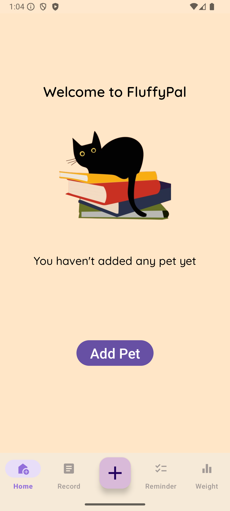
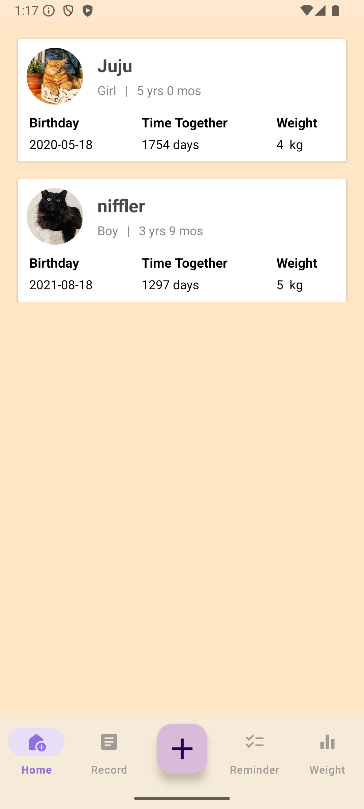
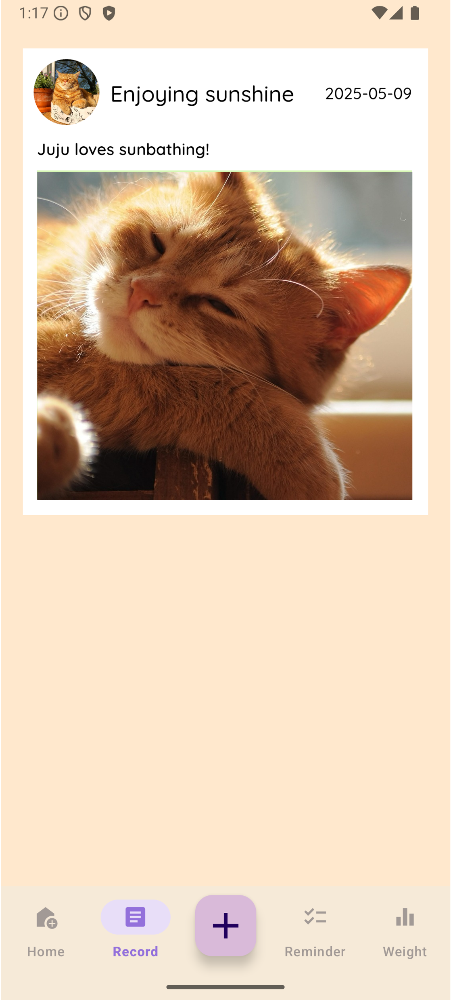
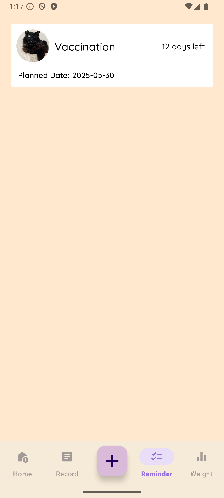
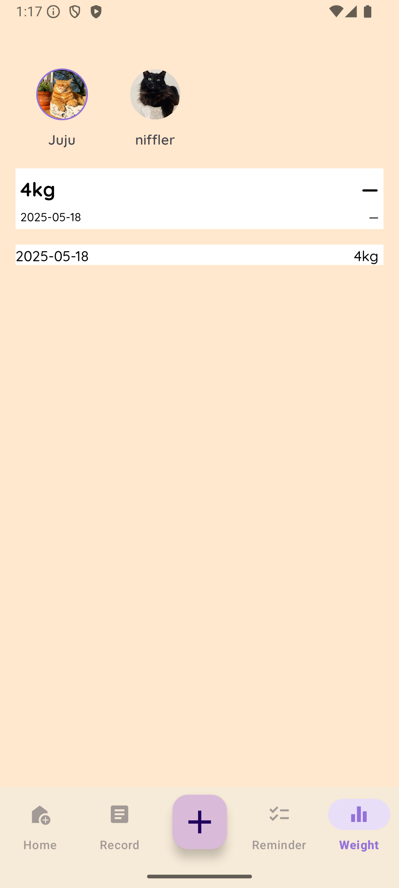

# FluffyPal  - Pet Management App

**FluffyPal** is an Android app designed to help pet owners manage and track their pets’ information easily. Users can add pet profiles, track weight records, set reminders, record pet activities, and enjoy a clean, user-friendly interface.

## Features

- **Add pets**: Record pet details including name, type, gender, birthday, and photo
- **Records**: Create records to keep track of pets' daily activities 
- **Reminders**: Create reminders for tasks like vaccination, grooming, and medication
- **Weight tracking**: Log weight records with date, automatically updates the latest weight

- **Swipe to delete**: Easily delete pets, activity record, and reminders with swipe gestures
- **Orientation support**: Fully compatible with both portrait and landscape modes

## UI Preview
<p float="left">
  
  
  
  
  
</p>

## Tech Stack

- Kotlin + Android Jetpack
- ViewModel + LiveData + SQLite
- RecyclerView + Navigation Component
- MutableLiveData for UI state management
- System Camera via ActivityResult API

## Getting Started

1. Clone the repository:
   ```bash
   git clone https://github.com/your-username/your-repository-name.git
2.	Open the project in Android Studio
3.	Connect a device or emulator and run the app   